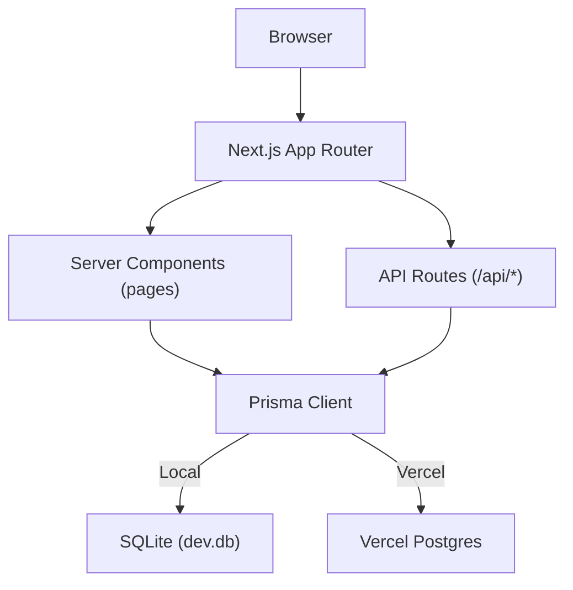
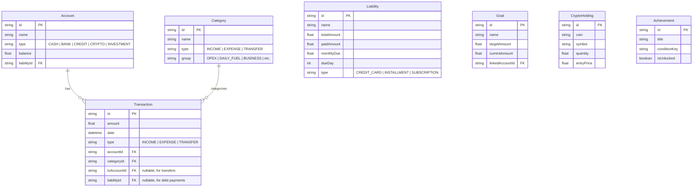

# Architecture Guide

## Overview

FinDev Tracker is a server-rendered Next.js 16 app using the App Router. All pages are **server components** that fetch data directly from the database — no client-side data layer needed.

The app uses a **dual database strategy**:
- **Local development**: SQLite via `@prisma/adapter-better-sqlite3`
- **Production (Vercel)**: PostgreSQL via Vercel Postgres

## System Architecture



## Data Models



## Database Connection

The Prisma client is initialized in `src/lib/db.ts` with environment-based routing:

```typescript
import { PrismaBetterSqlite3 } from "@prisma/adapter-better-sqlite3";

function createPrismaClient() {
  if (process.env.VERCEL || process.env.POSTGRES_PRISMA_URL) {
    return new PrismaClient({} as any); // Postgres (standard)
  } else {
    const adapter = new PrismaBetterSqlite3({ url: process.env.DATABASE_URL || "file:./dev.db" });
    return new PrismaClient({ adapter }); // SQLite (driver adapter)
  }
}
```

> **Note**: Prisma 7 uses the Client Engine (WASM) and requires a driver adapter for SQLite. The `PrismaBetterSqlite3` class is a factory that manages the `better-sqlite3` connection internally.

## Schema Switching (Local ↔ Production)

The `scripts/switch-db.js` script modifies `prisma/schema.prisma` for deployments:

| Command                              | Effect                                    |
| ------------------------------------ | ----------------------------------------- |
| `node scripts/switch-db.js auto`     | Detects environment, switches accordingly |
| `node scripts/switch-db.js postgres` | Forces PostgreSQL datasource              |
| `node scripts/switch-db.js sqlite`   | Forces SQLite datasource                  |

This runs automatically via the `postinstall` script in `package.json`.

## API Routes

| Endpoint            | Method            | Purpose                |
| ------------------- | ----------------- | ---------------------- |
| `/api/accounts`     | POST, PUT, DELETE | Manage accounts        |
| `/api/categories`   | POST, PUT, DELETE | Manage categories      |
| `/api/transactions` | POST, PUT, DELETE | Manage transactions    |
| `/api/liabilities`  | POST, PUT, DELETE | Manage liabilities     |
| `/api/goals`        | POST, PUT, DELETE | Manage goals           |
| `/api/investments`  | POST, PUT, DELETE | Manage crypto holdings |

## Pages

| Route           | Component          | Description                                           |
| --------------- | ------------------ | ----------------------------------------------------- |
| `/`             | `DashboardPage`    | KPI cards, charts, calendar, income/expense breakdown |
| `/transactions` | `TransactionsPage` | Filterable transaction list                           |
| `/liabilities`  | `LiabilitiesPage`  | Debt tracking with payment history                    |
| `/investments`  | `InvestmentsPage`  | Stock fund goals and crypto portfolio                 |
| `/achievements` | `AchievementsPage` | Gamification badges                                   |
| `/settings`     | `SettingsPage`     | Account and category management                       |

## Key Libraries

| Library                    | Usage                                           |
| -------------------------- | ----------------------------------------------- |
| `recharts`                 | Donut charts, bar charts, pie charts            |
| `lucide-react`             | Icon system (100+ icons)                        |
| `date-fns`                 | Date formatting and calculations                |
| `radix-ui`                 | Accessible UI primitives (Dialog, Select, etc.) |
| `class-variance-authority` | Component variant management                    |
